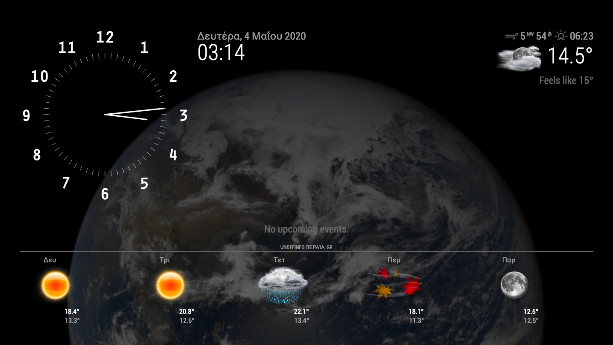

# What is it

A custom MagicMirror² setup delivered as a Docker image, based off https://github.com/bastilimbach/docker-MagicMirror.



# How to build the image

There are 2 Dockerfiles available, one to build a node:buster and one to build a node:alpine based image.

```bash
docker build ./ -f Dockerfile-alpine -t hypest/magic_mirror_hypest:x.x.x-alpine
```
and to build the node:buster based image use:

```bash
docker build ./ -f Dockerfile-alpine -t hypest/magic_mirror_hypest:x.x.x-alpine
```

# How to use

```bash
docker run  -d \
    --publish 80:8080 \
    --restart always \
    --volume /etc/localtime:/etc/localtime:ro \
    --env MM_LANGUAGE="<your language of choice. Example: el>" \
    --env MM_CALENDAR_URL="<URL to your Google Calendar .ics>" \
    --env MM_OMW_LOCATION_STRING="<OpenWeatherMap City String. Example: Peraia, GR>" \
    --env MM_OMW_LOCATION_ID=<OpenWeatherMap city ID. Example: 734712> \
    --env MM_OMW_APP_ID="<Your OpenWeatherMap app id. Get yours from https://openweathermap.org/appid>" \
    --name magic_mirror_hypest \
    hypest/magic_mirror_hypest
```
